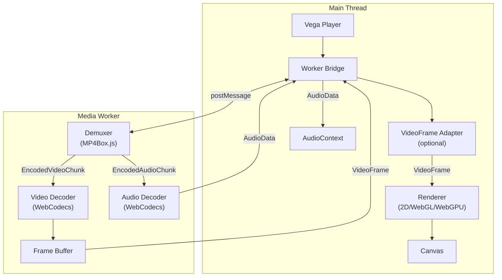

# Vega

See more. See better. See Vega

A WebCodecs-based MP4 video player with **custom VideoFrame processing** support. Apply real-time effects like fisheye undistortion, super resolution, or any custom image processing while the player handles decoding, synchronization, and rendering.

## Features

- **WebCodecs API**: Hardware-accelerated video decoding
- **Custom Frame Processing**: Inject your own VideoFrame adapter for real-time effects
- **Multiple Render Backends**: Canvas 2D, WebGL, and WebGPU
- **Web Worker Architecture**: Demuxing and decoding run in background threads
- **Audio Support**: WebAudio API with AudioWorklet (coming soon)
- **TypeScript**: Full type definitions included

## Install

```sh
npm install @gyeonghokim/vega
```

## Quick Start

```typescript
import { createVega } from "@gyeonghokim/vega";

const canvas = document.getElementById("video-canvas") as HTMLCanvasElement;

// Create player
const player = createVega({ canvas });

// Load and play
await player.load("video.mp4");
player.play();

// Controls
player.pause();
await player.seek(10); // Seek to 10 seconds
player.setVolume(0.5);
```

## Custom VideoFrame Adapter

The key feature of Vega is the ability to process every video frame before rendering. Use this for effects like lens correction, color grading, upscaling, or any custom image processing.

```typescript
import { createVega, type VideoFrameAdapter } from "@gyeonghokim/vega";

// Example: Grayscale filter adapter
const grayscaleAdapter: VideoFrameAdapter = {
  async process(frame: VideoFrame): Promise<VideoFrame> {
    // Create an OffscreenCanvas for processing
    const canvas = new OffscreenCanvas(frame.displayWidth, frame.displayHeight);
    const ctx = canvas.getContext("2d")!;
    
    // Draw the frame
    ctx.drawImage(frame, 0, 0);
    
    // Apply grayscale filter
    ctx.filter = "grayscale(100%)";
    ctx.drawImage(canvas, 0, 0);
    
    // Create new VideoFrame from processed canvas
    const processedFrame = new VideoFrame(canvas, {
      timestamp: frame.timestamp,
      duration: frame.duration ?? undefined,
    });
    
    // Close original frame (adapter is responsible for this)
    frame.close();
    
    return processedFrame;
  }
};

// Create player with adapter
const player = createVega({
  canvas: document.getElementById("canvas") as HTMLCanvasElement,
  adapter: grayscaleAdapter,
});

await player.load("video.mp4");
player.play();

// You can also change the adapter at runtime
player.setAdapter(null); // Remove adapter
player.setAdapter(grayscaleAdapter); // Set new adapter
```

### Using a third-party adapter

Any object that implements `VideoFrameAdapter` can be passed as `adapter` or via `player.setAdapter()`. For example, [@gyeonghokim/fisheye.js](https://www.npmjs.com/package/@gyeonghokim/fisheye.js) runs lens correction on the GPU and returns a **new** VideoFrame (input is not modified); the adapter must close the original frame:

```typescript
import { createVega, type VideoFrameAdapter } from "@gyeonghokim/vega";
import { Fisheye } from "@gyeonghokim/fisheye.js";

const canvas = document.getElementById("video-canvas") as HTMLCanvasElement;

const fisheye = new Fisheye({
  fx: 500,
  fy: 500,
  cx: 640,
  cy: 360,
  k1: 0.1,
  k2: 0,
  k3: 0,
  k4: 0,
  width: 1280,
  height: 720,
  projection: { kind: "rectilinear" },
});

const fisheyeAdapter: VideoFrameAdapter = {
  async process(frame: VideoFrame): Promise<VideoFrame> {
    const out = await fisheye.undistort(frame);
    frame.close();
    // Default/PTZ mode: single frame. Pane mode returns VideoFrame[].
    return out as VideoFrame;
  },
};

const player = createVega({ canvas, adapter: fisheyeAdapter });
await player.load("video.mp4");
player.play();
```

## API Reference

### `createVega(options: VegaOptions): Vega`

Creates a new Vega player instance.

#### Options

| Option | Type | Default | Description |
|--------|------|---------|-------------|
| `canvas` | `HTMLCanvasElement \| OffscreenCanvas` | required | Target canvas for video rendering |
| `rendererType` | `"2d" \| "webgl" \| "webgpu"` | `"2d"` | Rendering backend |
| `adapter` | `VideoFrameAdapter` | `undefined` | Custom frame processor |
| `volume` | `number` | `1.0` | Initial volume (0.0 - 1.0) |
| `loop` | `boolean` | `false` | Loop playback |
| `autoplay` | `boolean` | `false` | Auto-start after loading |

### Vega Instance Methods

```typescript
interface Vega {
  // Loading
  load(source: string | File | Blob): Promise<MediaInfo>;
  
  // Playback control
  play(): Promise<void>;
  pause(): void;
  seek(time: number): Promise<void>;
  stop(): void;
  
  // Properties (readonly)
  readonly currentTime: number;
  readonly duration: number;
  readonly paused: boolean;
  readonly ended: boolean;
  readonly volume: number;
  readonly muted: boolean;
  readonly state: PlaybackState;
  readonly mediaInfo: MediaInfo | null;
  
  // Settings
  setVolume(volume: number): void;
  setMuted(muted: boolean): void;
  setAdapter(adapter: VideoFrameAdapter | null): void;
  getAdapter(): VideoFrameAdapter | null;
  
  // Events
  on(event: VegaEvent, callback: VegaEventCallback): void;
  off(event: VegaEvent, callback: VegaEventCallback): void;
  
  // Cleanup
  destroy(): void;
}
```

### Events

| Event | Description |
|-------|-------------|
| `play` | Playback started |
| `pause` | Playback paused |
| `ended` | Playback ended |
| `seeking` | Seek operation started |
| `seeked` | Seek operation completed |
| `timeupdate` | Current time changed |
| `loadedmetadata` | Media info available |
| `canplay` | Ready to play |
| `waiting` | Buffering / waiting for data |
| `volumechange` | Volume or muted state changed |
| `error` | An error occurred |

### MediaInfo

Returned by `load()` and available via `player.mediaInfo`:

```typescript
interface MediaInfo {
  duration: number;
  videoTrack?: {
    codec: string;
    width: number;
    height: number;
    frameRate: number;
    bitrate?: number;
  };
  audioTrack?: {
    codec: string;
    sampleRate: number;
    channelCount: number;
    bitrate?: number;
  };
}
```

## VideoFrameAdapter Interface

```typescript
interface VideoFrameAdapter {
  /**
   * Process a VideoFrame before rendering.
   * @param frame - The decoded VideoFrame to process
   * @returns The processed VideoFrame (can be the same or a new one)
   */
  process(frame: VideoFrame): VideoFrame | Promise<VideoFrame>;
}
```

**Important**: If your adapter creates a new VideoFrame, you must close the original frame to prevent memory leaks.

## Raw Frame Utilities

For working with raw video data (e.g., from ffmpeg or custom sources):

```typescript
import {
  rawToVideoFrame,
  videoFrameToRaw,
  getRawByteLength,
  type SupportedPixelFormat,
} from "@gyeonghokim/vega";

// Raw buffer → VideoFrame
const raw = await (await fetch("frame_1920x1080_rgba.raw")).arrayBuffer();
const frame = rawToVideoFrame(raw, "RGBA", 1920, 1080, { timestamp: 0 });

// VideoFrame → raw buffer
const buffer = await videoFrameToRaw(frame);

// Calculate byte length for a format
const bytes = getRawByteLength("I420", 1920, 1080); // 3110400
```

Supported formats: `I420`, `I420A`, `I422`, `I444`, `I444A`, `NV12`, `RGBA`, `RGBX`, `BGRA`, `BGRX`

## Browser Requirements

- **WebCodecs API**: Required for video decoding
- **Web Workers**: Required for background processing
- **SharedArrayBuffer**: Required for audio (needs COOP/COEP headers)

For SharedArrayBuffer support, your server must send these headers:

```
Cross-Origin-Opener-Policy: same-origin
Cross-Origin-Embedder-Policy: require-corp
```

## Supported Formats

### Container
- MP4 (MPEG-4 Part 14)

### Video Codecs
- H.264 / AVC
- H.265 / HEVC
- VP8
- VP9
- AV1

### Audio Codecs
- AAC
- MP3
- Opus

## Development

```sh
npm install
npm run format      # Format code
npm run lint        # Lint code
npm run typecheck   # TypeScript check
npm test            # Run tests
npm run build       # Build library
```

## Architecture



## License

MIT
