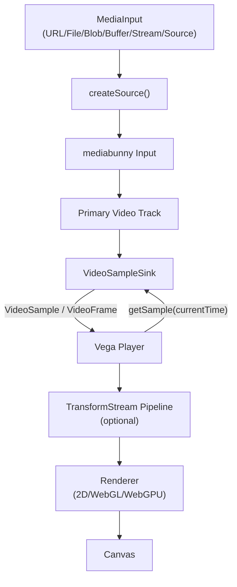

# Vega

See more. See better. See Vega

A WebCodecs-based MP4 player powered by mediabunny with **custom VideoFrame processing** via `pipeThrough(TransformStream)`.

## Features

- **WebCodecs API**: Hardware-accelerated video decoding
- **Custom Frame Processing**: Chain `TransformStream` stages for real-time effects
- **Multiple Render Backends**: Canvas 2D, WebGL, and WebGPU
- **Multi-Input Loading**: URL, URL object, File/Blob, ArrayBuffer/TypedArray, ReadableStream
- **Audio Support**: WebAudio API with AudioWorklet (coming soon)
- **TypeScript**: Full type definitions included

## Install

```sh
npm install @gyeonghokim/vega
```

## Quick Start

```typescript
import { createVega } from "@gyeonghokim/vega";

const canvas = document.getElementById("video-canvas");
if (!(canvas instanceof HTMLCanvasElement)) {
  throw new Error("Expected #video-canvas to be an HTMLCanvasElement");
}

// Create player
const player = createVega({ canvas });

// Load and play
await player.load("video.mp4");
player.play();

// Controls
player.pause();
await player.seek(10); // Seek to 10 seconds
player.setVolume(0.5);
```

## Custom VideoFrame Pipeline

The key feature of Vega is the ability to process every video frame before rendering. Use this for effects like lens correction, color grading, upscaling, or any custom image processing.

```typescript
import { createVega } from "@gyeonghokim/vega";

const canvas = document.getElementById("canvas");
if (!(canvas instanceof HTMLCanvasElement)) {
  throw new Error("Expected #canvas to be an HTMLCanvasElement");
}
const player = createVega({ canvas });

const identity = new TransformStream<VideoFrame, VideoFrame>({
  transform(frame, controller) {
    controller.enqueue(frame);
  },
});

player.pipeThrough(identity);
await player.load("video.mp4");
player.play();

player.clearPipeline();
```

### Using a third-party transform

You can wrap external frame processors in a `TransformStream<VideoFrame, VideoFrame>` and attach them with `pipeThrough()`.

```typescript
import { createVega } from "@gyeonghokim/vega";
import { Fisheye } from "@gyeonghokim/fisheye.js";

const canvas = document.getElementById("video-canvas");
if (!(canvas instanceof HTMLCanvasElement)) {
  throw new Error("Expected #video-canvas to be an HTMLCanvasElement");
}

const fisheye = new Fisheye({
  fx: 500,
  fy: 500,
  cx: 640,
  cy: 360,
  k1: 0.1,
  k2: 0,
  k3: 0,
  k4: 0,
  width: 1280,
  height: 720,
  projection: { kind: "rectilinear" },
});

const fisheyeTransform = new TransformStream<VideoFrame, VideoFrame>({
  async transform(frame, controller) {
    const out = await fisheye.undistort(frame);
    if (!(out instanceof VideoFrame)) {
      frame.close();
      throw new Error("Expected fisheye.undistort to return a VideoFrame");
    }
    frame.close();
    controller.enqueue(out);
  },
});

const player = createVega({ canvas });
player.pipeThrough(fisheyeTransform);
await player.load("video.mp4");
player.play();
```

## API Reference

### `createVega(options: VegaOptions): Vega`

Creates a new Vega player instance.

#### Options

| Option | Type | Default | Description |
|--------|------|---------|-------------|
| `canvas` | `HTMLCanvasElement \| OffscreenCanvas` | required | Target canvas for video rendering |
| `rendererType` | `"2d" \| "webgl" \| "webgpu"` | `"2d"` | Rendering backend |
| `formats` | `InputFormat[]` | `[MP4]` | Mediabunny input formats |
| `volume` | `number` | `1.0` | Initial volume (0.0 - 1.0) |
| `loop` | `boolean` | `false` | Loop playback |
| `autoplay` | `boolean` | `false` | Auto-start after loading |

### Vega Instance Methods

```typescript
interface Vega {
  // Loading
  load(source: MediaInput): Promise<MediaInfo>;
  
  // Playback control
  play(): Promise<void>;
  pause(): void;
  seek(time: number): Promise<void>;
  stop(): void;
  
  // Properties (readonly)
  readonly currentTime: number;
  readonly duration: number;
  readonly paused: boolean;
  readonly ended: boolean;
  readonly volume: number;
  readonly muted: boolean;
  readonly state: PlaybackState;
  readonly mediaInfo: MediaInfo | null;
  
  // Settings
  setVolume(volume: number): void;
  setMuted(muted: boolean): void;
  pipeThrough(transform: TransformStream<VideoFrame, VideoFrame>): void;
  clearPipeline(): void;
  
  // Events
  on(event: VegaEvent, callback: VegaEventCallback): void;
  off(event: VegaEvent, callback: VegaEventCallback): void;
  
  // Cleanup
  destroy(): void;
}
```

### Events

| Event | Description |
|-------|-------------|
| `play` | Playback started |
| `pause` | Playback paused |
| `ended` | Playback ended |
| `seeking` | Seek operation started |
| `seeked` | Seek operation completed |
| `timeupdate` | Current time changed |
| `loadedmetadata` | Media info available |
| `canplay` | Ready to play |
| `waiting` | Buffering / waiting for data |
| `volumechange` | Volume or muted state changed |
| `error` | An error occurred |

### MediaInfo

Returned by `load()` and available via `player.mediaInfo`:

```typescript
interface MediaInfo {
  duration: number;
  videoTrack?: {
    codec: string;
    width: number;
    height: number;
    frameRate: number;
    bitrate?: number;
  };
  audioTrack?: {
    codec: string;
    sampleRate: number;
    channelCount: number;
    bitrate?: number;
  };
}
```

`MediaInput` accepts: `string`, `URL`, `File`, `Blob`, `ArrayBuffer`, `ArrayBufferView`, `ReadableStream<Uint8Array>`, and mediabunny `Source`.

## Raw Frame Utilities

For working with raw video data (e.g., from ffmpeg or custom sources):

```typescript
import {
  rawToVideoFrame,
  videoFrameToRaw,
  getRawByteLength,
  type SupportedPixelFormat,
} from "@gyeonghokim/vega";

// Raw buffer → VideoFrame
const raw = await (await fetch("frame_1920x1080_rgba.raw")).arrayBuffer();
const frame = rawToVideoFrame(raw, "RGBA", 1920, 1080, { timestamp: 0 });

// VideoFrame → raw buffer
const buffer = await videoFrameToRaw(frame);

// Calculate byte length for a format
const bytes = getRawByteLength("I420", 1920, 1080); // 3110400
```

Supported formats: `I420`, `I420A`, `I422`, `I444`, `I444A`, `NV12`, `RGBA`, `RGBX`, `BGRA`, `BGRX`

## Browser Requirements

- **WebCodecs API**: Required for video decoding
- **TransformStream**: Required for `pipeThrough` frame pipelines

## Supported Formats

### Container
- MP4 (MPEG-4 Part 14)

### Video Codecs
- H.264 / AVC
- H.265 / HEVC
- VP8
- VP9
- AV1

### Audio Codecs
- AAC
- MP3
- Opus

## Development

```sh
npm install
npm run format      # Format code
npm run lint        # Lint code
npm run typecheck   # TypeScript check
npm test            # Run tests
npm run build       # Build library
```

## Architecture


```mermaid
flowchart TB
    Input["MediaInput<br/>(URL/File/Blob/Buffer/Stream/Source)"]
    SourceFactory["createSource()"]
    MBInput["mediabunny Input"]
    VideoTrack["Primary Video Track"]
    SampleSink["VideoSampleSink"]
    Vega["Vega Player"]
    Pipeline["TransformStream Pipeline<br/>(optional)"]
    Renderer["Renderer<br/>(2D/WebGL/WebGPU)"]
    Canvas["Canvas"]

    Input --> SourceFactory --> MBInput
    MBInput --> VideoTrack --> SampleSink
    Vega -->|"getSample(currentTime)"| SampleSink
    SampleSink -->|"VideoSample / VideoFrame"| Vega
    Vega --> Pipeline --> Renderer --> Canvas
```

## License

MIT
